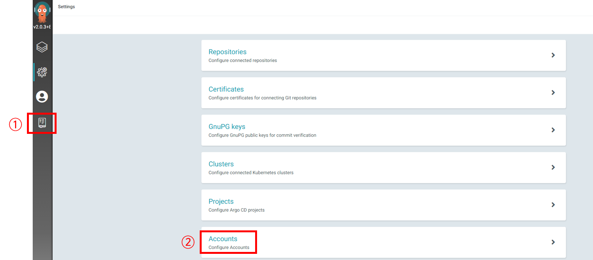
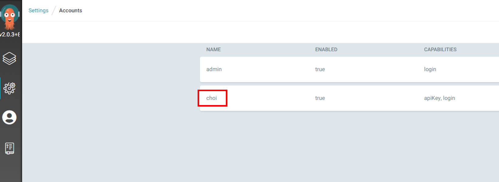
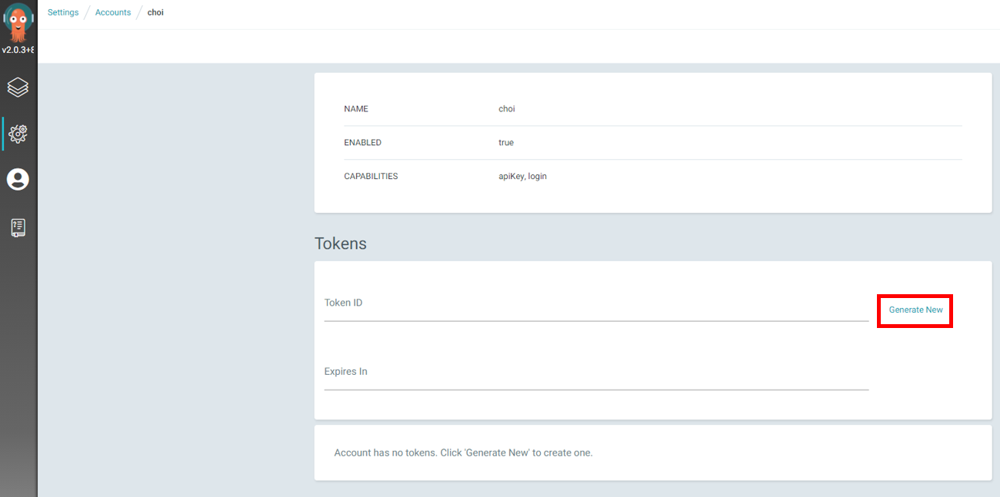

- [1. 개요](#1-개요)
- [2. 준비](#2-준비)
- [3. helm 저장소 추가](#3-helm-저장소-추가)
- [4. cert-manager issuer 생성](#4-cert-manager-issuer-생성)
  - [4.1 namespace 생성](#41-namespace-생성)
  - [4.2 네임서버 액세스 토큰 secret 생성](#42-네임서버-액세스-토큰-secret-생성)
  - [4.3 issuer 생성](#43-issuer-생성)
- [5. override_values.yaml파일 생성](#5-override_valuesyaml파일-생성)
- [6. helm 설치](#6-helm-설치)
- [7. 초기 로그인 계정/비밀번호](#7-초기-로그인-계정비밀번호)
- [8. 액세스 토큰 생성](#8-액세스-토큰-생성)
  - [8.1 계정 추가](#81-계정-추가)
  - [8.2 계정권한 설정](#82-계정권한-설정)
  - [8.3 계정 페이지 이동](#83-계정-페이지-이동)
  - [8.4 토큰 생성](#84-토큰-생성)

# 1. 개요
* argcod helm 설치와 설정 메뉴얼

<br>

# 2. 준비
* cert-manager 설치
* 외부접속 가능한 환경
* 도메인

<br>

# 3. helm 저장소 추가
```sh
helm repo add argo https://argoproj.github.io/argo-helm
helm repo update
```

<br>

# 4. cert-manager issuer 생성
* 아래 생성한 파일 모두 kubectl로 실행
```sh
kubectl apply -f .
```  

## 4.1 namespace 생성
```sh
kubectl create argocd
```

## 4.2 네임서버 액세스 토큰 secret 생성
```yaml
apiVersion: v1
kind: Secret
metadata:
  name: cloudflare-api-token-secret
  namespace: argocd
type: Opaque
stringData:
  api-token: <your nameserver token>
```

## 4.3 issuer 생성
```yaml
apiVersion: cert-manager.io/v1
kind: Issuer
metadata:
  name: argocd-prodissuser
  namespace: argocd
spec:
  acme:
    # The ACME server URL
    server: https://acme-v02.api.letsencrypt.org/directory
    # Email address used for ACME registration
    email: <youre email>
    # Name of a secret used to store the ACME account private key
    privateKeySecretRef:
      name: argocd-prodissuser
    # Enable the challenge provider
    solvers:
      - dns01:
          cloudflare:
            email: <youre email>
            apiTokenSecretRef:
              name: cloudflare-api-token-secret #cloudflare api token
              key: api-token
```

<br>

# 5. override_values.yaml파일 생성
* ingress 설정
```yaml
server:
  ingress:
    enabled: true
    annotations:
      kubernetes.io/ingress.class: nginx
      cert-manager.io/issuer: "argocd-prodissuser"
      nginx.ingress.kubernetes.io/proxy-body-size: "0"
      # reference: https://argoproj.github.io/argo-cd/operator-manual/ingress/#ssl-passthrough-with-cert-manager-and-lets-encrypt
      nginx.ingress.kubernetes.io/ssl-passthrough: "true"
      nginx.ingress.kubernetes.io/backend-protocol: "HTTPS"
    hosts:
      - argocd.choilab.xyz
    tls:
      - secretName: argocd-tls-certificate
        hosts:
          - argocd.choilab.xyz
    https: true
```

<br>

# 6. helm 설치
```sh
helm install -n argocd -f override_values.yaml  argocd argo/argo-cd
```


<br>

# 7. 초기 로그인 계정/비밀번호
* 계정: admin
* 비밀번호: 아래 명령어 실행
```sh
kubectl -n argocd get secret argocd-initial-admin-secret -o jsonpath="{.data.password}" | base64 -d; echo
```

# 8. 액세스 토큰 생성

## 8.1 계정 추가
> 참고자료: https://argoproj.github.io/argo-cd/operator-manual/user-management/
* configmap argocd-cm을 편집하여 api, 로그인이 가능한 계정 생성

```sh
kubectl edit configmap -n argocd argocd-cm
```

```yaml
apiVersion: v1
data:
  application.instanceLabelKey: argocd.argoproj.io/instance
  url: https://argocd.example.com
kind: ConfigMap
metadata:
  ...
data:
  accounts.choi: apiKey, login
```

## 8.2 계정권한 설정
> 참고자료: https://argoproj.github.io/argo-cd/operator-manual/rbac/
* configmap argocd-rbac-cm을 편집하여 추가한 계정에 관리자 권한 설정

```sh
kubectl edit configmap -n argocd argocd-rbac-cm
```

```yaml
apiVersion: v1
kind: ConfigMap
metadata:
  ...
data:
  policy.default: role:readonly
  policy.csv: |
    g, choi, role:admin
```

## 8.3 계정 페이지 이동





## 8.4 토큰 생성
* 토큰 생성버튼 클릭

