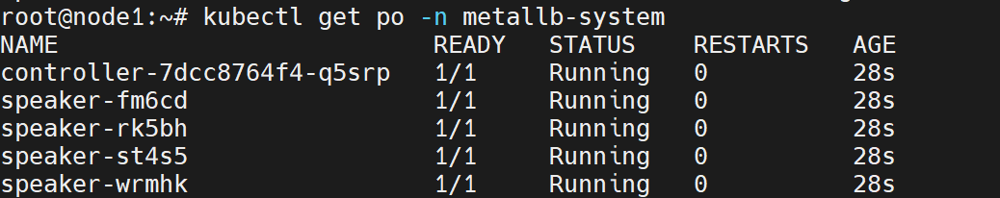

# 개요
* metallb 설치를 설명한다.
> 설치영상: https://youtu.be/VJhPYHJ8Zpk

<br>

# 설치
* 0.11버전 사용했다.
```sh
kubectl apply -f https://raw.githubusercontent.com/metallb/metallb/v0.11.0/manifests/namespace.yaml
kubectl apply -f https://raw.githubusercontent.com/metallb/metallb/v0.11.0/manifests/metallb.yaml
```

* metallb-system namespace에 pod가 실행된다.


<br>

# 설정
* loadbalancer IP대역 설정해야 한다.
* configmap.yaml파일을 생성하고 kubectl apply로 configmap을 적용한다.
```yaml
apiVersion: v1
kind: ConfigMap
metadata:
  namespace: metallb-system
  name: config
data:
  config: |
    address-pools:
    - name: default
      protocol: layer2
      addresses:
      - 10.10.20.170-10.10.20.190
```

<rb>

# 참고자료
* https://metallb.universe.tf/installation/