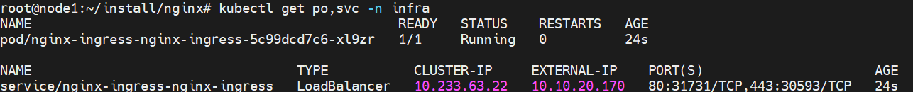

- [개요](#--)
- [helm 저장소 추가](#helm-------)
- [설치](#--)
- [참고자료](#----)

# 개요
* nginx ingress controller 설치방법을 설명합니다.

<br>

# helm 저장소 추가
```sh
helm repo add ingress-nginx https://kubernetes.github.io/ingress-nginx
helm repo update
```

<br>

# 설치
* infra namespace에 설치했습니다.
> metallb설치가 필요합니다.
```sh
kubectl create ns infra
helm install -n infra nginx-ingress nginx-stable/nginx-ingress
```



<br>

# ingress 리소스 생성방법
* ingress v1버전 이후에서는 ingressClassName필드가 꼭 필요합니다. 없으면 404 Not Found에러가 발생합니다.
> 참고자료: https://kubernetes.github.io/ingress-nginx/deploy/#local-testing
```yaml
apiVersion: apps/v1
kind: Deployment
metadata:
  name: nginx-test
  labels:
    app: nginx-test
spec:
  replicas: 2
  selector:
    matchLabels:
      app: nginx-test
  template:
    metadata:
      labels:
        app: nginx-test
    spec:
      containers:
      - name: nginx
        image: nginx:latest
        ports:
        - containerPort: 80
---
apiVersion: v1
kind: Service
metadata:
  name: nginx-test
spec:
  selector:
    app: nginx-test
  ports:
  - port: 80
    targetPort: 80
  type: ClusterIP
---
apiVersion: networking.k8s.io/v1
kind: Ingress
metadata:
  name: demo-localhost
spec:
  ingressClassName: nginx
  rules:
  - host: foo.bar.com
    http:
      paths:
      - backend:
          service:
            name: nginx-test
            port:
              number: 80
        path: /
        pathType: Prefix
```

# 참고자료
* https://docs.nginx.com/nginx-ingress-controller/installation/installation-with-helm/
* https://kubernetes.github.io/ingress-nginx/deploy/#local-testing
* https://github.com/kubernetes/ingress-nginx